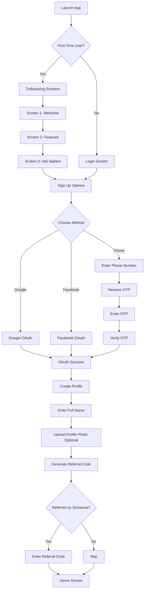
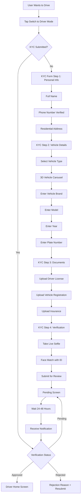
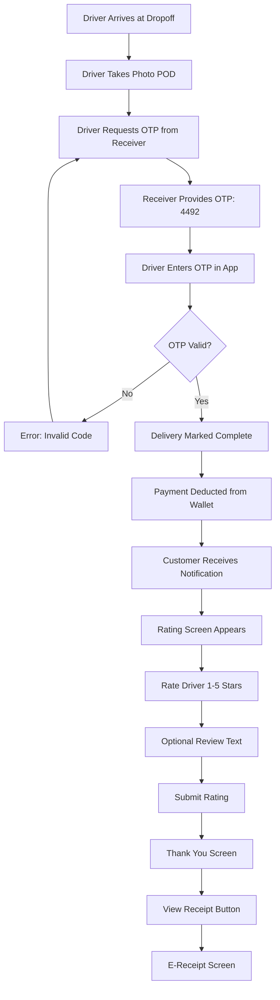
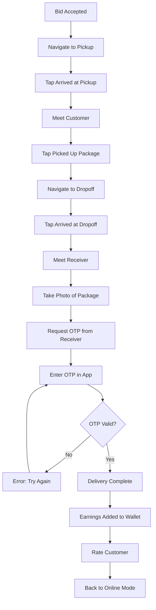
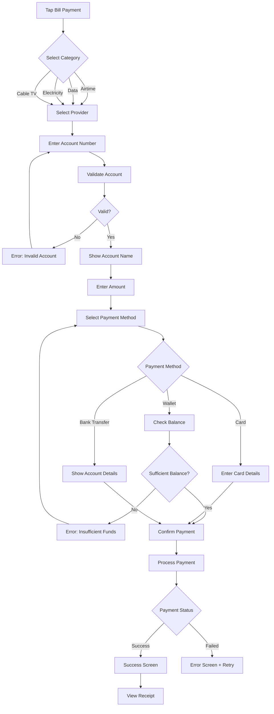

# ADLgo Feature Breakdown & User Flows

> **Detailed Feature Specifications and User Journey Documentation**

## Table of Contents
1. [Feature Overview](#1-feature-overview)
2. [Authentication & Onboarding](#2-authentication--onboarding)
3. [Customer App Features](#3-customer-app-features)
4. [Driver App Features](#4-driver-app-features)
5. [Bidding System](#5-bidding-system)
6. [Logistics Features](#6-logistics-features)
7. [Fintech & Payments](#7-fintech--payments)
8. [Communication System](#8-communication-system)
9. [Rating & Feedback](#9-rating--feedback)
10. [Admin Dashboard](#10-admin-dashboard)

---

## 1. Feature Overview

### 1.1 Core Value Propositions

**For Customers:**
- Send packages with competitive pricing through driver bidding
- Pay utility bills seamlessly from one app
- Real-time package tracking with security features
- Unified wallet for all transactions

**For Drivers:**
- Choose deliveries based on profitability
- Counter-bid to maximize earnings
- Flexible online/offline control
- Transparent earnings and instant payouts

### 1.2 Feature Matrix

| Feature Category | Customer | Driver | Admin |
|-----------------|----------|--------|-------|
| **Authentication** | ✅ Phone/Social | ✅ Phone + KYC | ✅ Email/Password |
| **Delivery Creation** | ✅ | ❌ | ✅ View All |
| **Bidding** | ✅ Accept Bids | ✅ Place Bids | ✅ Monitor |
| **Real-time Tracking** | ✅ Track Driver | ✅ Navigate | ✅ Monitor |
| **In-app Chat/Call** | ✅ | ✅ | ❌ |
| **Bill Payments** | ✅ | ✅ | ✅ View Transactions |
| **Wallet** | ✅ | ✅ | ✅ Manage |
| **Ratings** | ✅ Rate Driver | ✅ Rate Customer | ✅ View All |
| **Mode Switching** | ✅ | ✅ | ❌ |

---

## 2. Authentication & Onboarding

### 2.1 User Registration Flow



### 2.2 Onboarding Screens

#### Screen 1: Your Go-To Parcel Solution
- **Visual**: 3D illustration of packages with delivery vehicles
- **Headline**: "Your Go-To Parcel Solution"
- **Subtext**: "+5000 Successful delivery"
- **CTA**: "Next" button

#### Screen 2: Deliver Smarter, Faster
- **Visual**: Delivery van in motion
- **Headline**: "Deliver Smarter, Faster."
- **Subtext**: "Tracked by 2500+ happy customers."
- **CTA**: "Next" button

#### Screen 3: Fast & Reliable Deliveries
- **Visual**: Delivery person with package
- **Headline**: "Fast & Reliable Deliveries"
- **Subtext**: "Send and receive parcels anytime, anywhere"
- **CTA**: "Get Started" button

### 2.3 Driver KYC Verification Flow



#### KYC Document Requirements

| Document | Format | Max Size | Validation |
|----------|--------|----------|------------|
| Driver's License | JPG/PNG/PDF | 5MB | OCR + Manual Review |
| Vehicle Registration | JPG/PNG/PDF | 5MB | Manual Review |
| Insurance Certificate | JPG/PNG/PDF | 5MB | Manual Review |
| Selfie Photo | JPG/PNG | 2MB | Face Recognition API |

---

## 3. Customer App Features

### 3.1 Home Screen (Super App Dashboard)

```
┌─────────────────────────────────┐
│ ☰  Good Morning, Tunde    💰₦12K│
├─────────────────────────────────┤
│                                 │
│  ┌─────────────────────────┐   │
│  │   📦 Send Package       │   │
│  │   Quick & Reliable      │   │
│  └─────────────────────────┘   │
│                                 │
│  ┌──────┐ ┌──────┐ ┌──────┐   │
│  │ 📱   │ │ 💡   │ │ 📺   │   │
│  │Airtime│ │Bills │ │Cable │   │
│  └──────┘ └──────┘ └──────┘   │
│                                 │
│  Recent Deliveries              │
│  ┌─────────────────────────┐   │
│  │ ID: H314315796          │   │
│  │ Wuse 2 → Gwarinpa      │   │
│  │ ₦1,500 • In Transit    │   │
│  └─────────────────────────┘   │
│                                 │
│  Bill Payment Providers         │
│  [MTN] [Airtel] [DSTV] [GOTV]  │
│                                 │
├─────────────────────────────────┤
│  🏠  📦  💰  👤  (Bottom Nav)   │
└─────────────────────────────────┘
```

#### Home Screen Components

**Header:**
- Greeting with user's first name
- Wallet balance (tap to view details)
- Menu icon (left) for settings
- Notification bell (right)

**Main Service Card:**
- Large "Send Package" card with 3D icon
- Prominent placement, primary CTA

**Quick Actions Grid:**
- Buy Airtime
- Pay Bills
- Cable TV
- History

**Recent Deliveries:**
- Last 3 deliveries with status
- Tap to view details

**Bill Payment Shortcuts:**
- Provider logos (MTN, Airtel, DSTV, etc.)
- Quick access to payment modals

### 3.2 Create Delivery Flow

```mermaid
flowchart TD
    A[Tap Send Package] --> B[Delivery Creation Screen]
    
    B --> C[Step 1: Locations]
    C --> D[Pickup Location Input]
    D --> E[Google Places Autocomplete]
    E --> F[Select Pickup Address]
    F --> G[Dropoff Location Input]
    G --> H[Google Places Autocomplete]
    H --> I[Select Dropoff Address]
    
    I --> J[Step 2: Package Details]
    J --> K[What are you sending?]
    K --> L{Package Type}
    L -->|Documents| M
    L -->|Electronics| M
    L -->|Food| M
    L -->|Other| M
    
    M[Package Description Optional] --> N[Step 3: Pricing]
    
    N --> O[App Suggests Price: ₦1,500]
    O --> P[Offer Your Price Input]
    P --> Q[Step 4: Vehicle Selection]
    
    Q --> R[3D Vehicle Carousel]
    R --> S{Choose Vehicle}
    S -->|Bike| T[₦1,200 - ₦1,800]
    S -->|Car| T[₦1,500 - ₦2,500]
    S -->|Van| T[₦2,000 - ₦3,500]
    S -->|Truck| T[₦3,000 - ₦5,000]
    
    T --> U[Step 5: Delivery Category]
    U --> V{Select Category}
    V -->|Express| W[< 3 hours]
    V -->|Standard| W[< 5 hours]
    V -->|Same Day| W[< 8 hours]
    
    W --> X[Review Summary]
    X --> Y[Confirm & Find Driver Button]
    Y --> Z[Finding Driver Screen]
```



#### Create Delivery Screen Specifications

**Step 1: Locations**
- Map preview showing route
- Distance calculation (e.g., "5.2 km")
- Estimated time (e.g., "15 mins")
- Current location button for pickup

**Step 2: Package Details**
- Package type chips (Documents, Electronics, Food, Other)
- Optional description text area (max 500 chars)
- Package photo upload (optional)

**Step 3: Pricing**
- App-suggested price based on distance
- Editable price input field
- Price range indicator
- "Why this price?" info tooltip

**Step 4: Vehicle Selection**
- 3D isometric vehicle icons
- Vehicle name and capacity
- Typical price range
- Horizontal scrollable carousel

**Step 5: Delivery Category**
- Three cards: Express, Standard, Same Day
- Time estimates
- Price multipliers (Express +20%, Standard base, Same Day -10%)

**Review Summary:**
- Pickup → Dropoff addresses
- Package type
- Your offer: ₦1,500
- Vehicle: Bike
- Category: Standard
- "Confirm & Find Driver" CTA

### 3.3 Finding Driver (Bidding War)

```
┌─────────────────────────────────┐
│ ← Finding Driver...        ⋮   │
├─────────────────────────────────┤
│                                 │
│      [Radar Animation]          │
│   Looking for nearby drivers... │
│                                 │
│  ┌─────────────────────────┐   │
│  │ 🚗 Musa                 │   │
│  │ ⭐ 4.8 • Toyota Camry   │   │
│  │ Offers: ₦1,800          │   │
│  │         [Accept Bid] ───┤   │
│  └─────────────────────────┘   │
│                                 │
│  ┌─────────────────────────┐   │
│  │ 🏍️ John                 │   │
│  │ ⭐ 4.5 • Bike           │   │
│  │ Accepts: ₦1,500         │   │
│  │         [Accept Bid] ───┤   │
│  └─────────────────────────┘   │
│                                 │
│  ┌─────────────────────────┐   │
│  │ 🚗 Ahmed                │   │
│  │ ⭐ 4.9 • Honda Accord   │   │
│  │ Offers: ₦2,000          │   │
│  │         [Accept Bid] ───┤   │
│  └─────────────────────────┘   │
│                                 │
│  [Cancel Request]               │
└─────────────────────────────────┘
```

#### Bidding Screen Features

**Real-time Updates:**
- New bids appear instantly via WebSocket
- Sorted by: Price (low to high) or Rating (high to low)
- Filter by vehicle type

**Driver Card Information:**
- Driver photo
- Driver name
- Rating (average of last 100 deliveries)
- Vehicle type and model
- Bid amount
- Distance from pickup (e.g., "2.5 km away")
- Estimated arrival time (e.g., "5 mins")

**Actions:**
- Accept Bid button (primary)
- View Driver Profile (tap on card)
- Cancel Request (bottom)

**Timeout:**
- If no bids after 3 minutes, suggest increasing price
- Option to auto-accept lowest bid

### 3.4 Active Delivery Screen

```
┌─────────────────────────────────┐
│ ← Active Delivery          ⋮   │
├─────────────────────────────────┤
│                                 │
│  [Google Map with Route]        │
│  📍 Pickup (Orange Pin)         │
│  🏁 Dropoff (Green Pin)         │
│  🏍️ Driver Location (Moving)   │
│                                 │
├─────────────────────────────────┤
│  ┌─────────────────────────┐   │
│  │ 👤 John                 │   │
│  │ ⭐ 4.5 • Bike           │   │
│  │ Plate: ABC-123-XY       │   │
│  │ Status: Arriving...     │   │
│  │ ETA: 5 mins             │   │
│  │                         │   │
│  │ 💬 Chat    📞 Call      │   │
│  └─────────────────────────┘   │
│                                 │
│  ┌─────────────────────────┐   │
│  │ 🔐 Delivery Code        │   │
│  │      4492               │   │
│  │ Give this to driver     │   │
│  └─────────────────────────┘   │
│                                 │
│  [Cancel Delivery]              │
└─────────────────────────────────┘
```

#### Active Delivery Features

**Map View:**
- Real-time driver location updates (every 5 seconds)
- Polyline showing route
- Animated vehicle icon moving along route
- Zoom controls

**Driver Card:**
- Driver photo, name, rating
- Vehicle details and plate number
- Current status (Arriving, Picked Up, In Transit)
- ETA to pickup/dropoff

**Communication:**
- Chat button → Opens in-app chat
- Call button → Initiates masked VoIP call

**Security Code:**
- 4-digit OTP displayed prominently
- Copy to clipboard button
- Receiver must provide this to driver

**Status Updates:**
- "Driver is arriving at pickup"
- "Driver has picked up your package"
- "Package is in transit"
- "Driver is arriving at dropoff"

### 3.5 Delivery Completion & Rating



#### Rating Screen

```
┌─────────────────────────────────┐
│      Rate Your Experience       │
├─────────────────────────────────┤
│                                 │
│        👤 John                  │
│                                 │
│     ⭐ ⭐ ⭐ ⭐ ⭐             │
│   (Tap to rate 1-5 stars)       │
│                                 │
│  ┌─────────────────────────┐   │
│  │ How was your delivery?  │   │
│  │                         │   │
│  │ (Optional review)       │   │
│  └─────────────────────────┘   │
│                                 │
│  [Submit Rating]                │
│  [Skip]                         │
└─────────────────────────────────┘
```

---

## 4. Driver App Features

### 4.1 Driver Home Screen (Online Mode)

```
┌─────────────────────────────────┐
│ ☰  Driver Mode    [●] Online   │
│                    💰 ₦5,500    │
├─────────────────────────────────┤
│                                 │
│  [Google Map - Full Screen]     │
│  📍 Your Location (Blue Dot)    │
│                                 │
│                                 │
│                                 │
│                                 │
│                                 │
├─────────────────────────────────┤
│  ┌─────────────────────────┐   │
│  │ 🔍 Waiting for orders...│   │
│  │    [Pulse Animation]    │   │
│  │                         │   │
│  │ Today's Earnings: ₦2,300│   │
│  │ Deliveries: 3           │   │
│  └─────────────────────────┘   │
└─────────────────────────────────┘
```

#### Driver Home Features

**Header:**
- Menu icon
- "Driver Mode" label
- Online/Offline toggle switch
- Wallet balance

**Map View:**
- Driver's current location
- Nearby delivery requests (optional pins)
- Traffic layer toggle

**Bottom Sheet:**
- Waiting state with pulse animation
- Today's earnings summary
- Number of deliveries completed
- "View History" button

**Online/Offline Toggle:**
- Green = Online (receiving requests)
- Gray = Offline (not receiving requests)
- Haptic feedback on toggle

### 4.2 Order Request (Bidding Screen)

```
┌─────────────────────────────────┐
│  [Map with Route Highlighted]   │
│  📍 Wuse 2 → 🏁 Gwarinpa        │
├─────────────────────────────────┤
│  ┌─────────────────────────┐   │
│  │ 📦 New Delivery Request │   │
│  │                         │   │
│  │ From: Wuse 2            │   │
│  │ To: Gwarinpa            │   │
│  │ Distance: 5.2 km        │   │
│  │ Package: Documents      │   │
│  │                         │   │
│  │ Customer Offers: ₦1,500 │   │
│  │                         │   │
│  │ ┌─────┐ ┌─────┐ ┌─────┐│   │
│  │ │Accept│ │ Bid │ │ Bid ││   │
│  │ │₦1,500│ │₦1,800│ │₦2,000││   │
│  │ └─────┘ └─────┘ └─────┘│   │
│  │                         │   │
│  │ [Custom Bid] [Decline]  │   │
│  │                         │   │
│  │ ⏱️ Expires in: 02:45    │   │
│  └─────────────────────────┘   │
└─────────────────────────────────┘
```

#### Order Request Features

**Notification:**
- Loud sound + vibration
- Full-screen modal (can't dismiss easily)
- Auto-decline after 3 minutes

**Request Information:**
- Pickup and dropoff locations
- Distance and estimated time
- Package type and description
- Customer's offer price
- Customer rating (e.g., "⭐ 4.7")

**Bidding Options:**
- **Accept**: Accept customer's offer immediately
- **Quick Bids**: Pre-set counter-offers (+20%, +33%)
- **Custom Bid**: Enter any amount
- **Decline**: Reject the request

**Timer:**
- Countdown showing time left to respond
- Visual progress bar
- Urgent state when < 30 seconds

### 4.3 Active Delivery (Driver View)

```
┌─────────────────────────────────┐
│ ← Delivery Details         ⋮   │
├─────────────────────────────────┤
│  [Map with Navigation]          │
│  📍 Current Location            │
│  🎯 Destination (Pickup/Dropoff)│
├─────────────────────────────────┤
│  ┌─────────────────────────┐   │
│  │ ID: H314315796          │   │
│  │                         │   │
│  │ Pickup: Wuse 2          │   │
│  │ Dropoff: Gwarinpa       │   │
│  │                         │   │
│  │ Customer: Tunde         │   │
│  │ Phone: ****7654         │   │
│  │                         │   │
│  │ Package: Documents      │   │
│  │ Earnings: ₦1,800        │   │
│  │                         │   │
│  │ 💬 Chat    📞 Call      │   │
│  │                         │   │
│  │ [Arrived at Pickup]     │   │
│  └─────────────────────────┘   │
└─────────────────────────────────┘
```

#### Driver Delivery Flow



#### Status Update Buttons

| Status | Button Text | Action |
|--------|-------------|--------|
| Assigned | "Arrived at Pickup" | Mark arrival at pickup |
| Arrived | "Picked Up Package" | Confirm package collected |
| Picked Up | "Arrived at Dropoff" | Mark arrival at dropoff |
| At Dropoff | "Take Photo" | Capture proof of delivery |
| Photo Taken | "Enter OTP" | Input 4-digit code |
| OTP Verified | "Complete Delivery" | Finalize and get paid |

### 4.4 Proof of Delivery (POD)

```
┌─────────────────────────────────┐
│ ← Proof of Delivery        ⋮   │
├─────────────────────────────────┤
│                                 │
│  [Camera Viewfinder]            │
│  📦 Center package in frame     │
│                                 │
│  ┌─────────────────────────┐   │
│  │                         │   │
│  │    [Package Preview]    │   │
│  │                         │   │
│  └─────────────────────────┘   │
│                                 │
│  [📸 Capture Photo]             │
│  [🔄 Retake]                    │
│                                 │
│  ┌─────────────────────────┐   │
│  │ Enter Delivery Code     │   │
│  │  [_] [_] [_] [_]        │   │
│  └─────────────────────────┘   │
│                                 │
│  [Complete Delivery]            │
└─────────────────────────────────┘
```

---

## 5. Bidding System

### 5.1 Bidding Algorithm

```typescript
// Suggested price calculation
function calculateSuggestedPrice(delivery: Delivery): number {
  const baseRate = 200; // ₦200 base fare
  const perKmRate = getPerKmRate(delivery.vehicleType);
  const categoryMultiplier = getCategoryMultiplier(delivery.category);
  const timeOfDayMultiplier = getTimeMultiplier(new Date());
  
  const distancePrice = delivery.distance * perKmRate;
  const totalPrice = (baseRate + distancePrice) * categoryMultiplier * timeOfDayMultiplier;
  
  return Math.round(totalPrice / 50) * 50; // Round to nearest ₦50
}

// Per km rates by vehicle type
function getPerKmRate(vehicleType: string): number {
  const rates = {
    bike: 150,
    car: 200,
    van: 300,
    truck: 450
  };
  return rates[vehicleType] || 200;
}

// Category multipliers
function getCategoryMultiplier(category: string): number {
  const multipliers = {
    express: 1.2,    // +20%
    standard: 1.0,   // Base
    same_day: 0.9    // -10%
  };
  return multipliers[category] || 1.0;
}

// Time of day surge pricing
function getTimeMultiplier(time: Date): number {
  const hour = time.getHours();
  
  // Peak hours: 7-9 AM, 5-7 PM
  if ((hour >= 7 && hour <= 9) || (hour >= 17 && hour <= 19)) {
    return 1.15; // +15% surge
  }
  
  // Late night: 10 PM - 5 AM
  if (hour >= 22 || hour <= 5) {
    return 1.25; // +25% surge
  }
  
  return 1.0; // Normal pricing
}
```

### 5.2 Bid Matching Logic

```typescript
// Driver receives notification if:
function shouldNotifyDriver(driver: Driver, delivery: Delivery): boolean {
  // 1. Driver is online
  if (!driver.isOnline) return false;
  
  // 2. Driver's vehicle matches required type
  if (driver.vehicleType !== delivery.vehicleType) return false;
  
  // 3. Driver is within 10km of pickup
  const distance = calculateDistance(
    driver.currentLocation,
    delivery.pickupLocation
  );
  if (distance > 10) return false;
  
  // 4. Driver has good standing (rating > 3.5)
  if (driver.ratingAverage < 3.5) return false;
  
  // 5. Driver doesn't have active delivery
  if (driver.hasActiveDelivery) return false;
  
  return true;
}
```

### 5.3 Bid Expiration

- **Customer's Request**: Expires after 10 minutes if no driver accepts
- **Driver's Bid**: Expires after 5 minutes if customer doesn't respond
- **Auto-decline**: If driver doesn't respond to request within 3 minutes

---

## 6. Logistics Features

### 6.1 Real-Time Tracking

**Customer View:**
- See driver's live location on map
- Polyline showing route
- ETA updates every 30 seconds
- Driver's heading (direction arrow)

**Driver View:**
- Turn-by-turn navigation
- Traffic-aware routing
- Alternative routes suggestion
- Offline map support

### 6.2 Location Services

```typescript
// Location tracking configuration
const locationConfig = {
  accuracy: 'high',
  distanceFilter: 10, // Update every 10 meters
  interval: 5000,     // Update every 5 seconds
  fastestInterval: 3000,
  showsBackgroundLocationIndicator: true,
  foregroundService: {
    notificationTitle: 'ADLgo is tracking your delivery',
    notificationBody: 'Tap to return to app'
  }
};
```

### 6.3 Map Features

| Feature | Customer | Driver |
|---------|----------|--------|
| Live Location | ✅ View Driver | ✅ Own Location |
| Route Display | ✅ | ✅ |
| Traffic Layer | ❌ | ✅ |
| Satellite View | ✅ | ✅ |
| Street View | ✅ | ✅ |
| Offline Maps | ❌ | ✅ |
| Turn-by-Turn | ❌ | ✅ |

---

## 7. Fintech & Payments

### 7.1 Wallet System

```
┌─────────────────────────────────┐
│ ← My Wallet                ⋮   │
├─────────────────────────────────┤
│                                 │
│  ┌─────────────────────────┐   │
│  │ Available Balance       │   │
│  │ ₦12,450.00              │   │
│  │                         │   │
│  │ [Add Money] [Withdraw]  │   │
│  └─────────────────────────┘   │
│                                 │
│  Quick Actions                  │
│  [Send Money] [Request Money]   │
│                                 │
│  Transaction History            │
│  ┌─────────────────────────┐   │
│  │ ↓ Wallet Funded         │   │
│  │ +₦5,000.00              │   │
│  │ Nov 26, 2025 • 10:30 AM │   │
│  └─────────────────────────┘   │
│  ┌─────────────────────────┐   │
│  │ ↑ Delivery Payment      │   │
│  │ -₦1,500.00              │   │
│  │ Nov 26, 2025 • 09:15 AM │   │
│  └─────────────────────────┘   │
│  ┌─────────────────────────┐   │
│  │ ↑ DSTV Subscription     │   │
│  │ -₦4,500.00              │   │
│  │ Nov 25, 2025 • 08:00 PM │   │
│  └─────────────────────────┘   │
│                                 │
│  [View All Transactions]        │
└─────────────────────────────────┘
```

#### Wallet Features

**Add Money:**
- Card payment (Mastercard, Visa)
- Bank transfer
- USSD code
- Minimum: ₦100, Maximum: ₦500,000

**Withdraw:**
- To linked bank account
- Processing time: 24 hours
- Minimum: ₦1,000
- Fee: ₦50 flat

**Transaction Types:**
- Delivery payments (debit)
- Bill payments (debit)
- Wallet funding (credit)
- Driver earnings (credit)
- Refunds (credit)
- Commission deductions (debit)

### 7.2 Bill Payment Flow



#### Bill Payment Categories

**Airtime Top-up:**
- Providers: MTN, Airtel, Glo, 9mobile
- Amount: ₦50 - ₦50,000
- Instant delivery

**Data Bundles:**
- Providers: MTN, Airtel, Glo, 9mobile
- Plans: Daily, Weekly, Monthly
- Instant activation

**Electricity:**
- Providers: Ikeja Electric, Eko Electric, Abuja Electric, etc.
- Prepaid and postpaid
- Instant token delivery

**Cable TV:**
- Providers: DSTV, GOTV, StarTimes
- Subscription packages
- Instant activation

### 7.3 Payment Methods

```
┌─────────────────────────────────┐
│ ← Payment Method           ⋮   │
├─────────────────────────────────┤
│                                 │
│  ┌─────────────────────────┐   │
│  │ 💳 Master Card          │   │
│  │ •••• •••• •••• 8463     │   │
│  │                      ✓  │   │
│  └─────────────────────────┘   │
│                                 │
│  ┌─────────────────────────┐   │
│  │ 🅿️ Paypal               │   │
│  │ user****@gmail.com      │   │
│  │                      ○  │   │
│  └─────────────────────────┘   │
│                                 │
│  ┌─────────────────────────┐   │
│  │  Apple Pay              │   │
│  │                      ○  │   │
│  └─────────────────────────┘   │
│                                 │
│  + Add Payment Method           │
│                                 │
│  Delivery Address               │
│  ┌─────────────────────────┐   │
│  │ 📍 A3/4 Jawhra, Jeddah  │   │
│  │ Riyadh 1030          >  │   │
│  └─────────────────────────┘   │
│                                 │
│  Order Summary                  │
│  Order Amount        ₦80.00     │
│  Promo-code          +₦2.20     │
│  Delivery            +₦6.00     │
│  Tax                 +₦2.00     │
│  ─────────────────────────────  │
│  Total Amount      ₦ 85.80      │
│                                 │
│  [Pay Now]                      │
└─────────────────────────────────┘
```

---

## 8. Communication System

### 8.1 In-App Chat

```
┌─────────────────────────────────┐
│ ← Khalid Omar              📞 💬│
├─────────────────────────────────┤
│                                 │
│  Hey Khalid, just checking -    │
│  have my parcel been sent?      │
│                         9:18 PM │
│                                 │
│                 Yes, it's on the│
│                 way now as I've │
│                 just despatched │
│                 from Dhyafah.   │
│                         9:18 AM │
│                                 │
│  Does when can I expect the     │
│  delivery?                      │
│                         9:19 AM │
│                                 │
│  [Share Location] [Call Courier]│
│  [Delivery Time Lock]           │
│                                 │
├─────────────────────────────────┤
│ + Type your message... 😊 🎤    │
└─────────────────────────────────┘
```

#### Chat Features

- **Real-time Messaging**: WebSocket-powered instant delivery
- **Message Status**: Sent, Delivered, Read
- **Quick Actions**: Share location, Call courier, Set delivery time
- **Media Sharing**: Photos only (for package condition)
- **Auto-suggestions**: "I'm here", "Running late", "Thank you"
- **Message History**: Stored for 30 days

### 8.2 VoIP Calling

**Masked Numbers:**
- Customer sees: `+234-XXX-XXXX-1234`
- Driver sees: `+234-XXX-XXXX-5678`
- Actual numbers hidden for privacy

**Call Features:**
- Voice calls only (no video)
- Call recording for disputes
- Call duration limit: 10 minutes
- Auto-disconnect after delivery complete

---

## 9. Rating & Feedback

### 9.1 Rating Criteria

**Customer Rates Driver:**
- Professionalism
- Timeliness
- Package handling
- Communication

**Driver Rates Customer:**
- Clear instructions
- Availability
- Package condition
- Respectfulness

### 9.2 Rating Impact

| Rating | Impact |
|--------|--------|
| 5 Stars | Boost in algorithm, priority requests |
| 4 Stars | Neutral, no impact |
| 3 Stars | Warning notification |
| 1-2 Stars | Account review, possible suspension |

**Minimum Rating Threshold:**
- Drivers: Must maintain 3.5+ average
- Customers: Must maintain 3.0+ average
- Below threshold: Account restricted

---

## 10. Admin Dashboard

### 10.1 Dashboard Overview

```
┌─────────────────────────────────────────────────┐
│ ADLgo Admin Dashboard                    👤 Admin│
├─────────────────────────────────────────────────┤
│                                                 │
│  📊 Overview                                    │
│  ┌──────┐ ┌──────┐ ┌──────┐ ┌──────┐          │
│  │ 1,234│ │  456 │ │ 89%  │ │₦1.2M │          │
│  │Deliver│ │Drivers│ │Success│ │Revenue│          │
│  └──────┘ └──────┘ └──────┘ └──────┘          │
│                                                 │
│  📦 Active Deliveries (Real-time)              │
│  [Map View with all active deliveries]         │
│                                                 │
│  Recent Deliveries                              │
│  ID          Customer    Driver    Status      │
│  H314315796  Tunde       Musa      In Transit  │
│  K787655307  Amina       John      Delivered   │
│  B314315764  Chidi       Ahmed     Cancelled   │
│                                                 │
│  [View All] [Export CSV]                        │
│                                                 │
│  Pending KYC Verifications (5)                  │
│  [Review Queue]                                 │
│                                                 │
│  Disputes & Support (3 Open)                    │
│  [View Tickets]                                 │
└─────────────────────────────────────────────────┘
```

### 10.2 Admin Features

**User Management:**
- View all users (customers, drivers)
- Suspend/activate accounts
- View transaction history
- Manage wallet balances

**Driver Verification:**
- Review KYC documents
- Approve/reject applications
- Request additional documents
- Manual verification override

**Delivery Management:**
- View all deliveries (past, active)
- Cancel deliveries
- Refund customers
- Assign drivers manually

**Financial Management:**
- View all transactions
- Process withdrawals
- Manage commission rates
- Generate financial reports

**Analytics:**
- Delivery volume trends
- Revenue analytics
- Driver performance metrics
- Customer satisfaction scores

**Support:**
- View support tickets
- Resolve disputes
- Chat with users
- Issue refunds

---

## Conclusion

This feature breakdown provides a comprehensive guide to all user flows and functionalities within the ADLgo platform. Each feature is designed to provide maximum value while maintaining simplicity and ease of use.

For technical implementation details, refer to the Architecture Blueprint. For visual specifications, refer to the Design System documentation.
